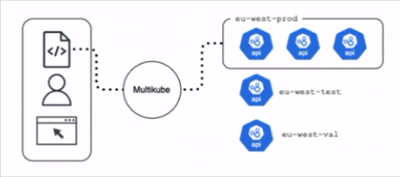

# Multikube

   

---

Multikube is an API-driven HTTP reverse proxy and load balancer for [Kubernetes](http://kubernetes.io/) API server. It sits at the edge, terminates client TLS connections, authenticates and authorizes requests, and forwards them to one or more backend Kubernetes clusters on behalf of the client. The goal is to provide a transparent, compatible way to access multiple clusters through a single control point without having to deploy complicated auth and authz layers in each cluster.

  

> **Note**: This project is under active early development and unstable. Features, APIs, and behavior are subject to change at any time and may not be backwards compatible between versions. Expect breaking changes.

## Why multikube?

Managing access to multiple Kubernetes clusters usually means juggling kubeconfigs, auth integrations, audit concerns, and operational policies across many independent API servers. multikube centralizes this at the edge while allowing users to continue using familiar tools like kubectl.

In many organizations, access to Kubernetes API servers is fronted by enterprise-grade load balancers such as F5 BigIP or similar platforms. While powerful, these solutions are often expensive, complex, and controlled by centralized infrastructure teams, limiting the flexibility and autonomy of DevOps teams. In other cases, such centralized load balancing capabilities are not available at all, leaving teams to manage access using ad hoc or fragile setups.

multikube shifts that control closer to the teams that need it. It provides a lightweight, API-driven edge proxy that replaces the need for heavyweight external load balancers for Kubernetes API access, allowing DevOps teams to manage routing, authentication, and access policies themselves.

## What is multikube?

multikube is a transparent, API-driven edge proxy for Kubernetes API servers that centralizes access, security, and observability across multiple clusters. It sits in front of one or more Kubernetes API servers, terminates TLS, and handles authentication and authorization on behalf of the client using mechanisms such as JWT, OIDC, or basic auth. By moving these concerns to the edge, multikube removes the need to configure and maintain authentication integrations within each individual cluster, making it independent of Kubernetes distribution and significantly simplifying operations.

In addition to authentication, multikube addresses the limitations of Kubernetes RBAC, which is inherently static, resource-based, and scoped to a single cluster. Many real-world access requirements such as context-aware rules, time-based access, or fine-grained permissions on specific resources are difficult or impossible to express with native RBAC alone. multikube introduces a more flexible authorization layer that allows these policies to be defined centrally and enforced consistently across all clusters, without modifying the clusters themselves.

All traffic flowing through multikube can be audited and observed from a single point, providing centralized audit logging, metrics, and usage insights. This gives operators clear visibility into who is accessing which resources, across which clusters, and under what conditions, enabling better security monitoring and operational awareness.

multikube is designed to be fully compatible with existing Kubernetes clients, allowing users to continue using tools like kubectl and existing workflows without modification. At the same time, it exposes a declarative, API-driven control plane through REST and gRPC, along with a CLI, making it easy to define backends, routing rules, and policies as code. Together, this provides a consistent, scalable way to manage multi-cluster access with strong security, simplified configuration, and centralized control.

## Features

- Centralized authentication and authorization (JWT, OIDC, basic auth)
- Fine-grained, context-aware access control beyond native Kubernetes RBAC (in progress)
- Works with any Kubernetes distribution (no cluster-side auth configuration required)
- Reverse proxy and load balancer for Kubernetes API servers
- Connection reuse and caching to reduce API server load
- TLS termination and separation of network security domains
- Fully transparent to clients. Works with any `kubectl` command
- Centralized audit logging of all API requests
- Prometheus metrics for monitoring and usage insights
- Declarative, API-driven configuration (REST, gRPC, CLI)
- Minimal configuration and no components required on backend clusters

## Roadmap

- **Web UI**: In Progress
- **REST API**: Done ✅
- **Resource decoration:** Planned
- **Fine-grained policy authorization:** Done ✅
- **Policy enforcement:** Incubating
- **Cross-cluster indexing:** Planned
- **Kubernetes Manifest Compatibility:** Incubating
- **Ingress load balancing:** Planned

## Getting Started

See the [Getting Started Guide](/docs/getting-started.md) to set up your first cluster and run your first workload. See the full [Documentation](/docs/README.md) for installation and usage details.

## Contributing

Multikube is still evolving, so feedback and ideas are very welcome. If something is unclear, missing, or could work better, feel free to open an issue or start a discussion. Suggestions, design feedback, and pull requests are all appreciated 💜
